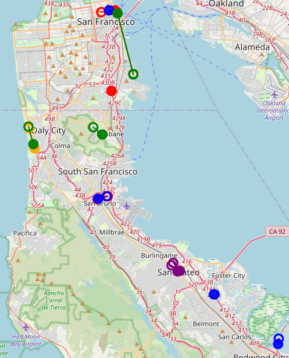

# This Week's Progress

We were able to run the US Census Geocoder on a subset of SF CoStar data (94% match rate), but encountered a scenario where places have "tie" entries (multiple coordinates found). Guidance on this is requested.

## Tasks Completed

- Created Template
- Cleaned and Standardized SF adresses
- Use Census Geocoder to geocode addresses

## Tasks In Progress

- Questions on handling errors

# Data Work

## Data Cleaning

All address-related variables are identified below @tbl-costar-vars.

| Variable                | Description                                                                |
|-------------------------|----------------------------------------------------------------------------|
| LeaseCompId             | Unique lease ID used as the join key                                      |
| PropertyId              | Unique property identifier                                                |
| PropertyName            | Building name                                                             |
| Market                  | CoStar metro market                                                       |
| Submarket               | CoStar submarket                                                          |
| Address.DeliveryAddress | Street address                                                            |
| Address.Locality        | City                                                                      |
| Address.County          | County                                                                    |
| Address.PostalCode      | ZIP / postal code                                                         |
| Address.RegionName      | State name (often missing; typically supplemented by Subdivision)        |
| Address.Subdivision     | State abbreviation                                                        |
| Address.Country         | Country                                                                   |
: CoStar Variables Retained for Geocoding {#tbl-costar-vars}

## Error Analysis

| Missing Count | Missing (%) | Present Count |
|---------------|-------------|---------------|
| 354           | 3.79        | 8,998         |
: Missing Address Summary {#tbl-missing}

# Issues and Questions

## Geocoding Ambiguity: Directional Prefixes and Street-Type Suffixes

The Census Geocoder returned multiple equally-scored matches ("ties") for a subset of addresses. Two distinct sources of ambiguity were identified:

1. **Directional prefixes** : the same street number resolves to different segments depending on the cardinal direction prefix (e.g., 256 **S** EL CAMINO REAL, SAN MATEO, CA 94401 vs. 256 **N** EL CAMINO REAL, SAN MATEO, CA 94401).
2. **Street-type suffixes** : the same street number resolves to different street subtypes (e.g., 100 SKYLINE **PLZ**, DALY CITY, CA 94015 vs. 100 SKYLINE **DR**, DALY CITY, CA 94015).

**Is there available directional information?**

The Haversine distance between paired tie candidates ranges from 0 to approximately 6 km across the Bay Area sample. @fig-tie-map plots each tie pair connected by a line, with the distance labeled at the midpoint. An interactive version is available at `temp/tie_records_map.html`.

{#fig-tie-map}

**How should ties be resolved?**  In previous work, I resolved similar issues by cross-referencing multiple geocoders, ranking their outputs, and selecting either the most credible or the geographic midpoint.

# Next Steps

- Use google maps API to fill remaining missing adresses

# Appendix {.appendix}

Link to code repository:

- https://github.com/WilliamClintC/Geocoding_Office

