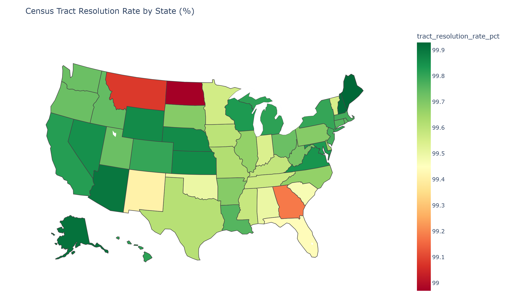

# This Week's Progress

This report is a follow-up to the 03/30 report and addresses a bug in the previous match-statistics summary. In that earlier report, the "one-to-one" category was misleading: it was presented as if it represented successful matches, when in fact it conflated three distinct outcomes: matched, did-not-match, and missing rows. This report corrects that classification and presents the updated numbers, with each outcome reported separately.

This report also updates the methodology of the matching algorithm: rather than returning the full geocoder match record, the algorithm is now scoped to output only the resolved census tract for each row. The revised methodology and the resulting output statistics are presented in the sections below.

# Overall Match Statistics

@tbl-overall-summary shows the geocoding match statistics across the entire U.S. dataset.

| Metric | Value |
| --- | --- |
| Total Properties | 1,051,219 |
| Matched | 970,482 |
| Tied (Multiple Candidates) | 6,697 |
| Matched or Tied | 977,179 |
| Strict Match Rate | 92.32% |
| Matched-or-Tied Rate | 92.96% |

: Whole U.S. Geocoding Overall Summary {#tbl-overall-summary}

@tbl-match-type shows the breakdown by match type.

| match_type | rows | pct |
| --- | --- | --- |
| One-to-One Matched | 970,482 | 92.32 |
| One-to-One Did Not Match | 73,355 | 6.98 |
| Missing | 685 | 0.07 |
| One-to-Many (Tie) | 6,697 | 0.64 |

: Whole U.S. Match Type Counts {#tbl-match-type}

# Whole U.S. Census Tract Resolution

## Tie Resolution Logic

Let $A$ denote the set of One-to-Many (tie) rows. For each row $i \in A$, let

- $C_i$ = the set of candidate matches returned by the geocoder for row $i$,
- $z_i$ = the input ZIP code of row $i$,
- $Z(c)$ = the ZIP code of candidate $c$,
- $T(c)$ = the census tract of candidate $c$.

Define the ZIP-matching subset of candidates
$$
C_i' \;=\; \{\, c \in C_i \;:\; Z(c) = z_i \,\} \;\subseteq\; C_i.
$$

The resolved census tract for row $i$ is then
$$
\widehat{T}(i) \;=\;
\begin{cases}
t, & \text{if } C_i' \neq \varnothing \;\text{and}\; T(c) = t \;\;\forall\, c \in C_i' \quad \text{(ZIP-matching ties)}, \\[4pt]
t, & \text{else if } T(c) = t \;\;\forall\, c \in C_i \quad \text{(all ties unanimous, fallback)}, \\[4pt]
\text{ambiguous}, & \text{otherwise.}
\end{cases}
$$

In words: among the tied candidates for row $i$, first restrict to those whose ZIP matches the input ZIP ($C_i'$); if that subset is non-empty and unanimous on a single tract $t$, output $t$. Otherwise, fall back to the full candidate set $C_i$: if *all* tied candidates agree on a single tract, output it. If neither condition holds, mark the row as ambiguous.

@tbl-whole-tract-resolution shows the Whole U.S. dataset (1,051,219 rows) collapsed from the geocoder match output to a single census tract per row. The resolution process was first validated on a San Francisco subset before being applied to the full U.S. dataset; see Appendix [-@sec-sf-validation] for those results.

| Resolution Method | Rows | Pct |
| --- | --- | --- |
| One-to-One Primary | 1,043,837 | 99.30% |
| Tie Resolved via ZIP-Matching Ties | 3,746 | 0.36% |
| Tie Resolved via All Ties Unanimous | 314 | 0.03% |
| Tract Ambiguous | 2,637 | 0.25% |
| Tract Missing | 685 | 0.07% |
| **Resolved to Single Tract** | **1,047,897** | **99.68%** |

: Whole U.S. Census Tract Resolution Summary {#tbl-whole-tract-resolution}

@tbl-whole-tie-resolution shows the breakdown for the 6,697 One-to-Many (tie) rows specifically.

| Tie Resolution Outcome                                      | Rows  | Pct of Tie Rows | Pct of Total Properties |
| ----------------------------------------------------------- | ----- | --------------- | ----------------------- |
| ZIP-matching ties share the same census tract (resolved)    | 3,746 | 55.94%          | 0.36%                   |
| All ties share the same census tract, fallback (resolved)   | 314   | 4.69%           | 0.03%                   |
| Tie outputs disagree on census tract (ambiguous)            | 2,637 | 39.38%          | 0.25%                   |
| **Total tie rows**                                          | **6,697** | **100.00%** | **0.64%**             |

: Whole U.S. Tie Row Tract Resolution {#tbl-whole-tie-resolution}

## State-Level Tract Resolution

{#fig-state-tract-map width=100%}

@fig-state-tract-map renders the resolution rate for the 50 states + DC. Even the worst-performing states are above 99%, and the variation across the country is small in absolute terms (about 0.75 percentage points between the best and worst).

@tbl-top-states shows the ten largest states by row count and their resolution rates. The `Resolved` column counts rows that the tract matcher successfully collapsed to a single census tract; the `Tract Resolution Rate` column expresses that as a percentage of total rows in each state.

| State | Total Rows | Resolved | Ambiguous | Missing | Strict Match Rate | Tract Resolution Rate |
| --- | ---: | ---: | ---: | ---: | ---: | ---: |
| CA | 165,793 | 165,498 | 271 | 24  | 95.18% | 99.82% |
| TX | 88,171  | 87,826  | 268 | 77  | 87.77% | 99.61% |
| FL | 79,864  | 79,414  | 320 | 130 | 91.74% | 99.44% |
| NY | 62,311  | 62,184  | 99  | 28  | 90.15% | 99.80% |
| IL | 39,768  | 39,635  | 102 | 31  | 92.94% | 99.67% |
| PA | 37,662  | 37,547  | 78  | 37  | 90.33% | 99.69% |
| OH | 37,188  | 37,086  | 81  | 21  | 94.44% | 99.73% |
| GA | 36,736  | 36,434  | 253 | 49  | 90.16% | 99.18% |
| NC | 34,365  | 34,251  | 102 | 12  | 93.07% | 99.67% |
| MI | 31,221  | 31,161  | 49  | 11  | 94.47% | 99.81% |

: Top 10 States by Row Count {#tbl-top-states}

Notably, while strict geocoder match rates vary considerably across these markets (87.77% in TX vs. 95.18% in CA), tract resolution rates compress to a narrow band (99.18%, 99.82%); the tract matcher's tie-resolution step recovers most of the rows the strict matcher leaves behind.

@tbl-state-full shows every state and territory in the dataset, sorted by strict match rate descending.

| State | Total | Matched | Tied | Resolved | Strict Match Rate (%) | Tract Resolution Rate (%) |
| --- | ---: | ---: | ---: | ---: | ---: | ---: |
| Rhode Island | 3,667 | 3,654 | 13 | 3,658 | 99.65 | 99.75 |
| New Hampshire | 3,782 | 3,768 | 14 | 3,779 | 99.63 | 99.92 |
| Massachusetts | 21,281 | 21,199 | 82 | 21,234 | 99.61 | 99.78 |
| Connecticut | 14,131 | 14,075 | 56 | 14,097 | 99.60 | 99.76 |
| Vermont | 1,101 | 1,096 | 5 | 1,096 | 99.55 | 99.55 |
| Maine | 2,975 | 2,957 | 18 | 2,973 | 99.39 | 99.93 |
| New Jersey | 30,168 | 29,957 | 211 | 30,101 | 99.30 | 99.78 |
| District of Columbia | 3,291 | 3,187 | 3 | 3,285 | 96.84 | 99.82 |
| Kansas | 7,596 | 7,296 | 32 | 7,585 | 96.05 | 99.86 |
| Alaska | 1,058 | 1,016 | 3 | 1,057 | 96.03 | 99.91 |
| California | 165,793 | 157,804 | 656 | 165,498 | 95.18 | 99.82 |
| Washington | 23,906 | 22,746 | 132 | 23,841 | 95.15 | 99.73 |
| Arizona | 24,670 | 23,373 | 60 | 24,646 | 94.74 | 99.90 |
| Colorado | 22,600 | 21,368 | 81 | 22,555 | 94.55 | 99.80 |
| Oregon | 14,913 | 14,093 | 81 | 14,872 | 94.50 | 99.73 |
| Michigan | 31,221 | 29,496 | 151 | 31,161 | 94.47 | 99.81 |
| Idaho | 5,704 | 5,388 | 32 | 5,689 | 94.46 | 99.74 |
| Ohio | 37,188 | 35,120 | 213 | 37,086 | 94.44 | 99.73 |
| Nevada | 11,878 | 11,194 | 50 | 11,860 | 94.24 | 99.85 |
| Nebraska | 4,953 | 4,666 | 17 | 4,946 | 94.21 | 99.86 |
| Iowa | 5,690 | 5,356 | 49 | 5,667 | 94.13 | 99.60 |
| South Dakota | 1,602 | 1,502 | 10 | 1,597 | 93.76 | 99.69 |
| Tennessee | 19,188 | 17,968 | 184 | 19,106 | 93.64 | 99.57 |
| Maryland | 18,351 | 17,116 | 77 | 18,320 | 93.27 | 99.83 |
| Virginia | 25,455 | 23,723 | 79 | 25,414 | 93.20 | 99.84 |
| North Carolina | 34,365 | 31,982 | 275 | 34,251 | 93.07 | 99.67 |
| Illinois | 39,768 | 36,959 | 310 | 39,635 | 92.94 | 99.67 |
| Indiana | 17,857 | 16,587 | 156 | 17,775 | 92.89 | 99.54 |
| Minnesota | 13,224 | 12,239 | 113 | 13,166 | 92.55 | 99.56 |
| Wisconsin | 13,646 | 12,598 | 70 | 13,623 | 92.32 | 99.83 |
| Montana | 1,959 | 1,807 | 24 | 1,941 | 92.24 | 99.08 |
| Utah | 10,044 | 9,256 | 56 | 10,017 | 92.15 | 99.73 |
| Delaware | 2,954 | 2,714 | 18 | 2,944 | 91.88 | 99.66 |
| Missouri | 17,780 | 16,327 | 179 | 17,713 | 91.83 | 99.62 |
| Oklahoma | 12,095 | 11,099 | 66 | 12,034 | 91.77 | 99.50 |
| Florida | 79,864 | 73,271 | 809 | 79,414 | 91.74 | 99.44 |
| New Mexico | 5,291 | 4,840 | 48 | 5,260 | 91.48 | 99.41 |
| South Carolina | 19,076 | 17,431 | 180 | 18,974 | 91.38 | 99.47 |
| Kentucky | 9,212 | 8,418 | 78 | 9,174 | 91.38 | 99.59 |
| Arkansas | 6,428 | 5,872 | 45 | 6,408 | 91.35 | 99.69 |
| Louisiana | 10,206 | 9,275 | 79 | 10,182 | 90.88 | 99.76 |
| Wyoming | 722 | 656 | 3 | 721 | 90.86 | 99.86 |
| Pennsylvania | 37,662 | 34,021 | 213 | 37,547 | 90.33 | 99.69 |
| Georgia | 36,736 | 33,120 | 479 | 36,434 | 90.16 | 99.18 |
| New York | 62,311 | 56,172 | 354 | 62,184 | 90.15 | 99.80 |
| Texas | 88,171 | 77,391 | 556 | 87,826 | 87.77 | 99.61 |
| North Dakota | 1,748 | 1,517 | 31 | 1,730 | 86.78 | 98.97 |
| Alabama | 11,378 | 9,789 | 141 | 11,321 | 86.03 | 99.50 |
| Mississippi | 4,320 | 3,655 | 77 | 4,302 | 84.61 | 99.58 |
| West Virginia | 2,724 | 2,114 | 17 | 2,716 | 77.61 | 99.71 |
| Hawaii | 3,197 | 2,254 | 11 | 3,191 | 70.50 | 99.81 |

: Match Rate by State (Sorted by Strict Match Rate, Descending) {#tbl-state-full}

# Appendix {.appendix}

## SF Subset Validation {#sec-sf-validation}

Before applying the resolution process to the full U.S. dataset, it was tested on a San Francisco subset to validate the approach.

@tbl-sf-tract-resolution shows the SF subset (9,352 rows) collapsed from the geocoder match output to a single census tract per row. One-to-Many (tie) rows resolve when all tie outputs share the same census tract; otherwise they are flagged as ambiguous.

| Resolution Method | Rows | Pct |
| --- | --- | --- |
| One-to-One Primary | 8,980 | 96.02% |
| Tie Resolved via ZIP-Matching Ties | 5 | 0.05% |
| Tie Resolved via All Ties Unanimous | 0 | 0.00% |
| Tract Ambiguous | 13 | 0.14% |
| Tract Missing | 354 | 3.79% |
| **Resolved to Single Tract** | **8,985** | **96.08%** |

: SF Census Tract Resolution Summary {#tbl-sf-tract-resolution}

@tbl-sf-tie-resolution shows the breakdown for the 18 One-to-Many (tie) rows specifically.

| Tie Resolution Outcome | Rows |
| --- | --- |
| ZIP-matching ties share the same census tract (resolved) | 5 |
| All ties share the same census tract, fallback (resolved) | 0 |
| Tie outputs disagree on census tract (ambiguous) | 13 |
| Total tie rows | 18 |

: SF Tie Row Tract Resolution {#tbl-sf-tie-resolution}

## Code Repository

- https://github.com/WilliamClintC/Geocoding_Office
